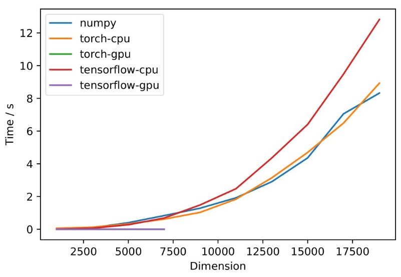

# Project: Comparison of NumPy, PyTorch, TensorFlow
### Course: DSC 210: Numerical Linear Algebra
### Instructor: Dr. Tsui-wei Weng

#### Instructions:
Ensure that the following libraries are available in a Python3 environment:
- numpy
- tqdm
- tensorflow (2.0+)
- matplotlib

Note that our expiriments are computationally expensive. A GPU is needed to run the sections that tests for speedups that GPUs provide for TensorFlow and PyTorch. For reference, we used a computer with the following specs:
- CPU: AMD EPYC 7453 28-Core Processor
- GPU: NVIDIA GeForce RTX 3090

Run all the cells in the notebook.

#### Results:

##### Multiplication:
 
